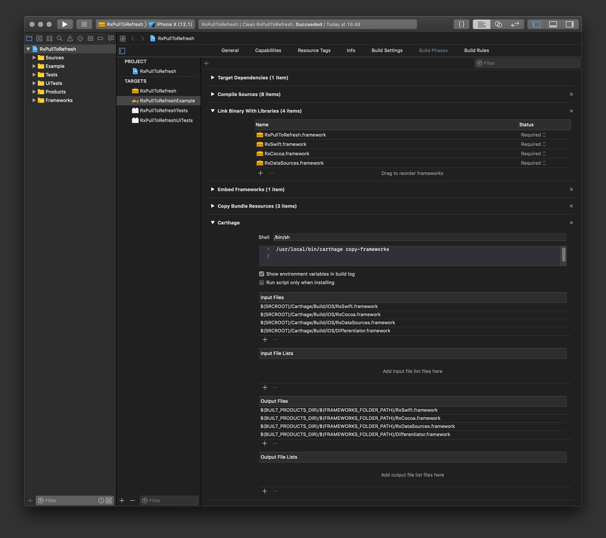

[](https://github.com/gumob/RxPullToRefresh)
[](https://travis-ci.com/gumob/RxPullToRefresh)
[](https://codecov.io/gh/gumob/RxPullToRefresh)
[](https://github.com/gumob/RxPullToRefresh)


# RxPullToRefresh
A Swift library enables you to create a pull to refreshable UIScrollView with a custom view supporting RxSwift.

## Requirements

- iOS 9.0 or later
- Swift 4.2

## Installation

### Carthage

Add the following to your `Cartfile` and follow [these instructions](https://github.com/Carthage/Carthage#adding-frameworks-to-an-application).

```
github "gumob/RxPullToRefresh"
```

Do not forget to include RxSwift.framework. Otherwise it will fail to build the application.<br/>



### CocoaPods

To integrate RxPullToRefresh into your project, add the following to your `Podfile`.

```ruby
platform :ios, '9.3'
use_frameworks!

pod 'RxPullToRefresh'
```

## Usage

Read the [usage](https://gumob.github.io/RxPullToRefresh/usage.html) and the [API reference](https://gumob.github.io/RxPullToRefresh/Classes/RxPullToRefresh.html) for detailed information.

## Copyright

RxPullToRefresh is released under MIT license, which means you can modify it, redistribute it or use it however you like.